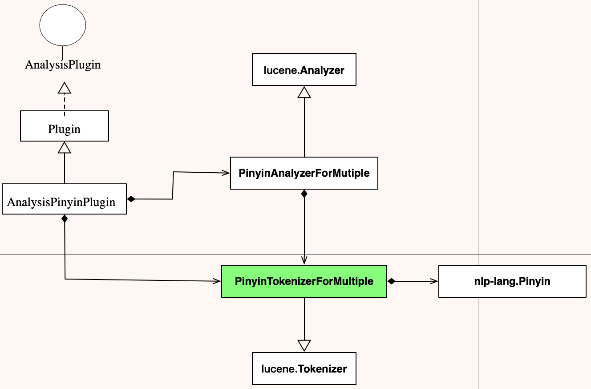
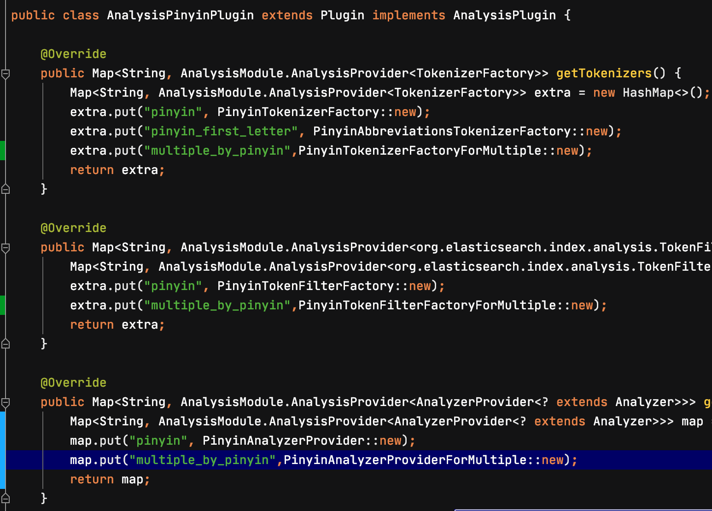

# elasticsearch-analysis-pinyin
ES汉语多音字分词插件

## 1. 构建环境
JDK：1.8
Maven：apache-maven-3.6.3
ElasticSearch版本：5.x系列

## 2. 应用场景
中文多音字分词，例如：“三一重工”，其中“重”是多音字，zhong或chong。如果用ES的默认拼音分词插件会解析成sanyizhonggong，但某些业务需要保留多音字：sanyizhonggong、sanyichonggong。

## 3. 解决方案
ES用的中文拼音插件是：elasticsearch-analysis-pinyin，它底层用的是nlp-lang来实现的自然语言分词。根据ES的版本从github上下载了对应版本的插件源代码，涉及到：elasticsearch-analysis-pinyin-5.x、nlp-lang-1.7.8。

### 3.1 核心类关系如下图

### 3.2 elasticsearch-analysis-pinyin
拼音分词插件AnalysisPinyinPlugin，它通过实现ES的org.elasticsearch.plugins.AnalysisPlugin、org.elasticsearch.plugins.Plugin，纳入了ES插件体系。 如图：，其中“pinyin”就是默认拼音分词的实现。我的想法是仿照“pinyin”分词实现一个多音字的拼音分词，例如叫“multiple_by_pinyin”。这样如果需要使用多音字分词的话，在索引的settings时选择多音字的分词即可。而那些使用默认的pinyin分词的用户也不会受影响。

### 3.3 nlp-lang
需要把lib/nlp-lang-1.7.8.jar放到ES的环境中
